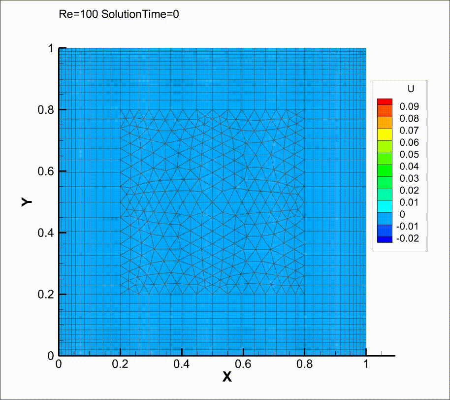

# Meso

此处进入 [旧版代码](https://github.com/yuzuki01/meso-archive)

## 新特性

### Vector

3 维向量

### Field<Scalar>

与网格相关联的标量场

格心 `Field<Scalar>(MESO::Mesh::Mesh, cell_field_flag)`

界面 `Field<Scalar>(MESO::Mesh::Mesh, face_field_flag)`

`gradient()` 方法可以得到网格格心 `Field<Vector>`

### Field<Vector>

与网格相关联的矢量场

### Quick Start

不可压 CDUGKS 求解器

```shell
./meso --case case.txt --max-step 50000 --save-interval 100 --parallel 10
```

配置文件:

```
[settings]
case-name       demo
result-path     ./result
mesh-file       cavity.neu

Re          400.0
Ma          0.1414213562373095
CFL         0.8

gradient-switch     True

gas-constant        0.5
ref-density         1.0
ref-length          1.0
ref-temperature     1.0

[group]
name        fluid-zone
density     1.0

[mark]
name        lid
type        wall
velocity-x  0.1

[mark]
name        wall
type        wall

```

网格使用 gambit `.neu` 格式


