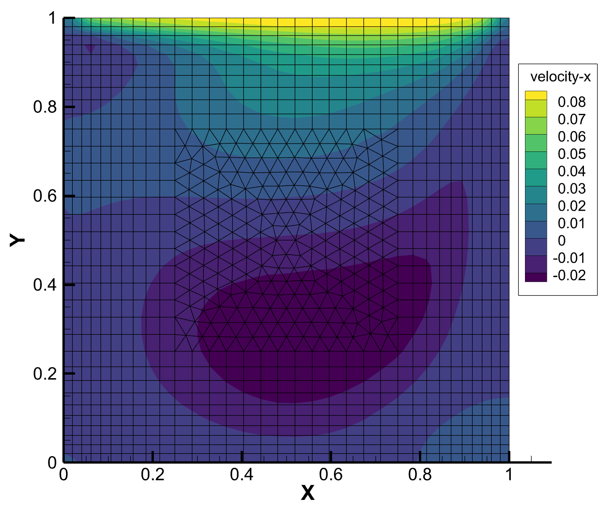

# Meso

- [快速构建](#快速构建)
    - Python 脚本快速构建
    - CMake 命令行构建
- [运行方式](#运行方式)
    - su2 网格
    - 配置文件
    - 启动参数
- [项目结构](#项目结构)
    - core
    - mesh
    - solver
    - api

---

非结构网格前处理 + DUGKS 求解器

重构前代码(<a href="https://github.com/yuzuki01/meso-archive">meso-archive</a>)已经不再维护，仅供参考

---

# 快速构建

在 Windows 10 和 Ubuntu 22.04 LTS 上成功构建:

|依赖|成功构建版本|是否必需|
|:---:|:---:|:---:|
|gcc|13.2.0|√|
|CMake|3.25|√|
|Python|3.9.10|×<p>通用构建脚本使用 Python 编写</p>|

## 使用构建脚本快速构建（推荐）

```
python build.py
```

## 使用命令行构建
```
git clone https://github.com/yuzuki01/meso-lts.git

# 进入项目根目录
cd meso-lts

# Windows 选取 <your_generator> 为 "CodeBlocks - MinGW Makefiles"
# Linux 选取 <your_generator> 为 "CodeBlocks - Unix Makefiles"
# 构建 Core 模块
cmake -DCMAKE_BUILD_TYPE=MinSizeRel -G <your_generator> -S ./src/core -B ./src/core/cmake-build-minsizerel
cmake --build ./src/core/cmake-build-minsizerel --target clean -- -j 12
cmake --build ./src/core/cmake-build-minsizerel --target all -- -j 12

# 构建 Mesh 模块
cmake -DCMAKE_BUILD_TYPE=MinSizeRel -G <your_generator> -S ./src/mesh -B ./src/mesh/cmake-build-minsizerel
cmake --build ./src/mesh/cmake-build-minsizerel --target clean -- -j 12
cmake --build ./src/mesh/cmake-build-minsizerel --target all -- -j 12

# 构建 Solver 模块
cmake -DCMAKE_BUILD_TYPE=MinSizeRel -G <your_generator> -S ./src/solver -B ./src/solver/cmake-build-minsizerel
cmake --build ./src/solver/cmake-build-minsizerel --target clean -- -j 12
cmake --build ./src/solver/cmake-build-minsizerel --target all -- -j 12

# 构建可执行文件
cmake -DCMAKE_BUILD_TYPE=MinSizeRel -G <your_generator> -S . -B ./cmake-build-minsizerel
cmake --build ./cmake-build-minsizerel --target clean -- -j 12
cmake --build ./cmake-build-minsizerel --target all -- -j 12
```

## 快速启动
```
# 如果当前目录在项目根目录，则进入构建目录
cd build
# 调用帮助指令
meso -h
```

# 运行方式

## su2 网格

meso 读取的是.su2网格

首先准备好.su2网格，[顶盖驱动方腔网格](files/mesh/cavity_hybrid.su2)作为测试文件，储存在 ./files/mesh/ 中

在构建出的可执行文件 meso.exe 的目录下找到 mesh 文件夹，这是求解器寻找网格文件的地方，拷贝顶盖驱动方腔网格到这个文件夹

## 配置文件

[顶盖驱动方腔配置文件](files/config/cavity.txt)作为测试文件，存储在 ./files/config/ 中

在构建出的可执行文件 meso.exe 的目录下找到 config 文件夹，这是求解器寻找配置文件的地方，拷贝顶盖驱动方腔配置文件到这个文件夹

## 运行求解器

在构建出的可执行文件 meso.exe 的目录下，打开终端执行

```
meso --case cavity.txt --max_step 50000 --save_interval 1000
```

之后在 result 文件夹下可以得到计算结果的 tecplot 文件



# 项目结构

---


---

## Core模块

[README](src/core/README.md)

## Mesh模块

[README](src/mesh/README.md)

## Solver模块

[README](src/solver/README.md)

## API模块

[README](src/api/README.md)
