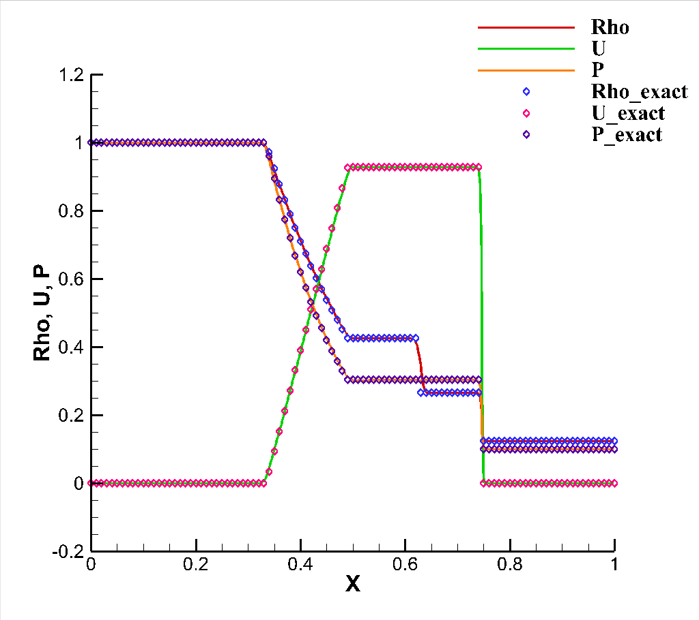

# Meso

此处进入 [旧版代码](https://github.com/yuzuki01/meso-archive)

## New Features

### Modules

**KarypisLab/METIS** - [here](https://github.com/KarypisLab/METIS)

> 物理网格划分使用 `METIS-5.1.0` ，按照 `MPI::processor_num` 进行划分

**Mesh Scale**

> 网格缩放，支持带量纲直接进行计算

**Boundary** - [README](./include/solver/README.md)

> pressure-inlet / pressure-outlet

> slip wall

> patch

### Vector

3 维向量

### Field\<Scalar\>

与网格相关联的标量场

格心 `Field<Scalar>(MESO::fvmMesh::fvmMesh, cell_field_flag)`

界面 `Field<Scalar>(MESO::fvmMesh::fvmMesh, face_field_flag)`

界面 `Field<Scalar>(MESO::fvmMesh::fvmMesh, node_field_flag)`

`gradient()` 方法可以得到网格格心梯度，数据类型为 `Field<Vector>`

### Field\<Vector\>

与网格相关联的矢量场

### Numpy API

通过配置文件增加 `output-np` 开关，可以输出 numpy 可读的文件

```c++
MESO::Field<Vector> vec_field(mesh, cell_field_flag);
vec_field.output("output.field.dat");
```

```python
import numpy as np

data = np.loadtxt("path/to/output.field.dat")
print(data.shape)

# (NCELL,) for Field<Scalar>
# (NCELL, 3) for Field<Vector>
```

### Quick Start

- 启动参数解析

```sh
./meso-mpi -h
```

- 不可压缩方腔 (Incompressible cavity flow)

```sh
mpirun -n 9 ./meso-mpi --case case-re400.txt
```

- 稀薄方腔 (Rarefied cavity flow)

```sh
mpirun -n 10 ./meso-mpi --case case-kn1.txt
```

### Configure File

[详细文档](include/solver/README.md)

```
[settings]
case-name       demo
mesh-file       <path-to>/<mesh>.neu
mesh-scale      1.0
dvs-file        <path-to>/<dvs-mesh>.neu/.dvs
dvs-type        <dvs-type>

Re          400.0
Ma          0.1414213562373095

gradient-switch     True

timeStep            2.5e-3
gas-constant        0.5
ref-density         1.0
ref-length          1.0
ref-temperature     1.0

[group]
name        fluid-zone
density     1.0

[mark]
name        lid
type        wall
velocity-x  0.1

[mark]
name        wall
type        wall

```

### fvmMesh

使用 gambit `.neu` 格式

### Result

| 输出  |   含义   |
|:---:|:------:|
| Rho |   质量   |
|  T  |   温度   |
|  U  | X 方向速度 |
|  V  | Y 方向速度 |
|  W  | Z 方向速度 |
| qx  | X 方向热流 |
| qy  | Y 方向热流 |
| qz  | Z 方向热流 |


### 1D Solver

Sod 激波管求解器为 1 维 CDUGKS，[代码](https://github.com/yuzuki01/tube)未整合进本项目.



## Future

 > 物理网格并行求解器开发
