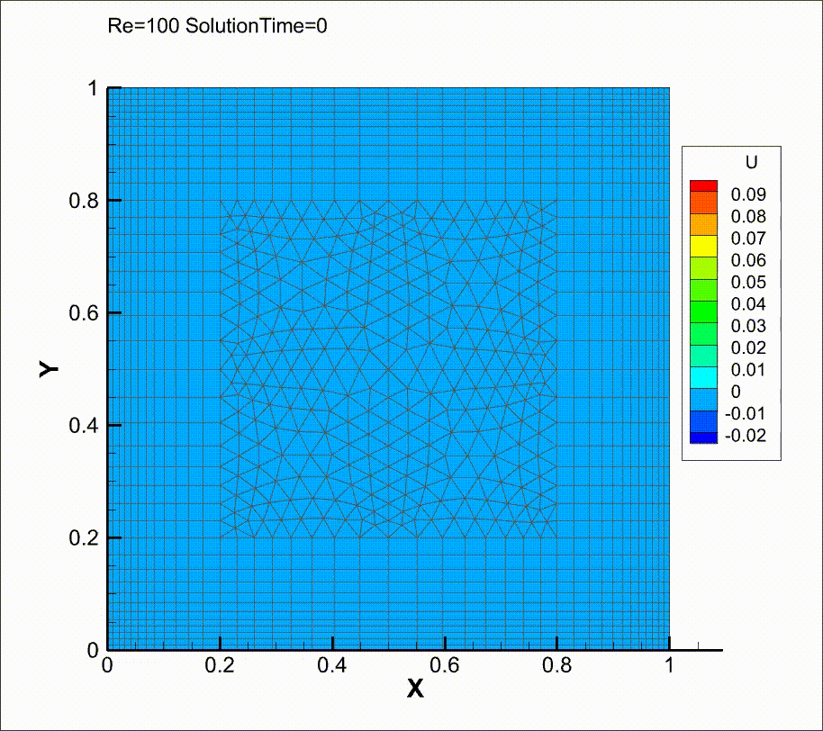

# Meso

此处进入 [旧版代码](https://github.com/yuzuki01/meso-archive)

## 新特性

### Vector

3 维向量

### Field<Scalar>

与网格相关联的标量场

格心 `Field<Scalar>(MESO::Mesh::Mesh, cell_field_flag)`

界面 `Field<Scalar>(MESO::Mesh::Mesh, face_field_flag)`

`gradient()` 方法可以得到网格格心 `Field<Vector>`

### Field<Vector>

与网格相关联的矢量场

### Quick Start

不可压 CDUGKS 求解器

#### 单节点启动: (仅openMP)

```shell
./meso --case case-re100.txt --max-step 50000 --save-interval 100 --parallel 10
```

#### 多节点启动: (跨节点mpi+本地openMP)

```shell
export LD_LIBRARY_PATH=/path/to/meso-libs:$LD_LIBRARY_PATH
mpirun -host node01, node02 /path/to/meso --parallel <omp_thread_num>
```

### 配置文件

[详细文档](src/solver/README.md)

```
[settings]
case-name       demo
mesh-file       /<absolute-path-to>/<mesh>.neu

Re          400.0
Ma          0.1414213562373095
CFL         0.8

gradient-switch     True

gas-constant        0.5
ref-density         1.0
ref-length          1.0
ref-temperature     1.0

[group]
name        fluid-zone
density     1.0

[mark]
name        lid
type        wall
velocity-x  0.1

[mark]
name        wall
type        wall

```

### 网格

使用 gambit `.neu` 格式

### 结果

| 输出  |        含义         |      |
|:---:|:-----------------:|:----:|
| m0  |   动理学分布函数 0 阶矩    |  质量  |
| m1x | 动理学分布函数 1 阶矩 x 分量 | x 动量 |
| m1y | 动理学分布函数 1 阶矩 y 分量 | y 动量 |
| m1z | 动理学分布函数 1 阶矩 z 分量 | z 动量 |


